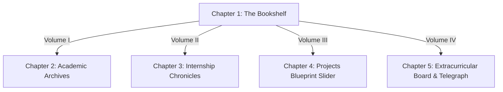

# Muhamad Zulkarnain — Japanese Manga Portfolio

A visually stunning, high-contrast, fully responsive developer portfolio inspired by traditional black-and-white Japanese manga and anime layouts. Designed with custom ink styling, speech bubbles, screentones, and interactive 3D elements.

---

## ✦ System Architecture & Design System

The system is configured as a fullscreen single-page scrolling experience divided into thematic chapters. Navigation is handled by interactive 3D manga volumes on the bookshelf guide.



### Key Design Elements:
* **Background Grid:** Styled as an organic printed manga page spread using a custom sepia-cream canvas (`#f6f4ee`) with a custom radial halftone dot pattern overlay and speedlines.
* **3D Spine Mechanics:** Custom vertical books representing portfolio sections that skew, scale, and cast shadows on hover.
* **Quest Log System:** Extracurricular achievements styled as active or completed bounties with custom quest stamps.

---

## ✦ Integrated Tech Inventory

* **Frontend Framework:** React 18 & Vite
* **Animations & Transitions:** GSAP (GreenSock Animation Platform) & GSAP ScrollTrigger
* **Styling Engine:** Vanilla CSS & custom CSS variables
* **Diagrams & Flowcharts:** Mermaid.js

---

## ✦ Repository Directory Map

```text
├── public/                 # Static asset delivery (Custom manga character avatars)
├── src/
│   ├── components/
│   │   ├── MangaBountyBoard.jsx # Extracurricular log & achievements list
│   │   ├── MangaContact.jsx     # Telegraph dispatch form module
│   │   ├── MangaCrossword.jsx   # Interactive crossword component
│   │   ├── MangaHeader.jsx      # Clean professional title banner
│   │   ├── MangaPanel.jsx       # Custom ink borders with sound effect tags (SFX)
│   │   └── MangaProjects.jsx    # Projects carousel slider and blueprint overlays
│   ├── App.css
│   ├── App.jsx             # Grid setup, stats filler & smooth-scroll controller
│   ├── index.css           # Sepia canvas backdrop and core screentone styling
│   └── main.jsx
├── index.html
├── package.json
└── vite.config.js
```

---

## ✦ Security & Deployment Audit

To align with modern security practices:
1. **Zero Secret Footprint:** No API keys, secret credentials, or personal identifiers are stored in the codebase.
2. **Environment Filtering:** The `.gitignore` has been updated to filter out local credentials (`.env`, local configuration modules, and private SSH keys) preventing accidental repository leaks.
3. **No Dynamic Input Execution:** All user inputs in the contact form are properly bound as React states and treated as plain text strings to prevent Cross-Site Scripting (XSS).

---

## ✦ Setup & Operations Guide

### Prerequisites
* **Node.js** (v18 or newer recommended)
* **npm** or **yarn**

### Installation
Clone the repository and install all dependencies:
```bash
git clone https://github.com/juyfonso/Portfolio_Website.git
cd Portfolio_Website
npm install
```

### Local Development Server
Launch the development server with Hot Module Replacement (HMR):
```bash
npm run dev
```

### Production Build
Generate optimized production bundles in the `dist/` directory:
```bash
npm run build
```
